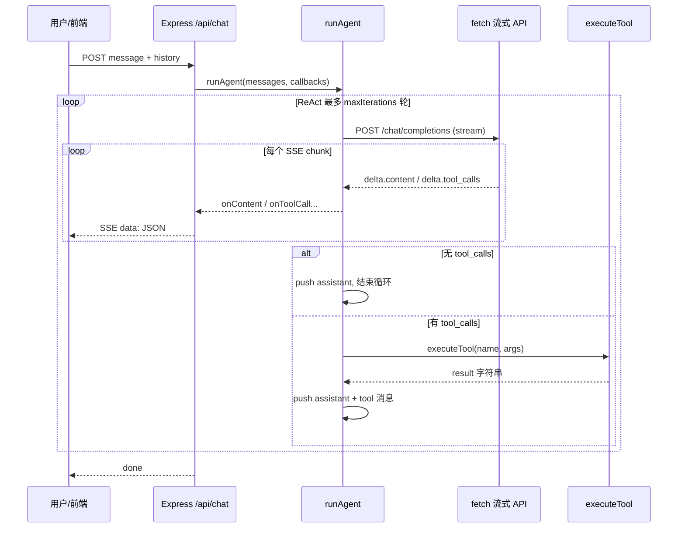

# JavaScript 原生实现 Agent：原理与代码对照

本文说明：**不依赖 LangChain / OpenAI 官方 SDK 时**，如何用浏览器与 Node 都支持的 **`fetch` + `ReadableStream`**，实现一个与「OpenAI 兼容 Chat Completions」对话的 **ReAct 风格工具 Agent**。阅读完成后，你应能回答：请求长什么样、流怎么读、工具调用如何闭环、消息历史如何维护。

---

## 1. 这类 Agent 在做什么

**Agent** 在这里指：以 **大语言模型（LLM）** 为决策核心，在需要时 **调用外部函数（工具）** 获取实时数据或执行计算，再把结果喂回模型，直到模型认为可以只用自然语言回答用户。

本项目的实现包含三层（由内到外）：

| 层次 | 职责 |
|------|------|
| **协议层** | HTTP `POST /chat/completions`，`stream: true`，按 SSE 解析增量 JSON |
| **循环层（ReAct）** | 反复：发消息 → 收 assistant 的文本或 `tool_calls` → 执行工具 → 把 `role: tool` 写回历史 → 再请求模型 |
| **工具层** | 把业务函数注册为 OpenAI 的 `tools[].function`（name / description / parameters），运行时按名分发执行 |

**ReAct**（Reason + Act）在本项目里被落实为：**推理在模型里完成，行动在你们的 `executeTool` 里完成**，二者通过 **标准消息数组** 衔接，而不是在黑盒框架里跑图。

---

## 2. OpenAI 兼容 API 里「工具调用」长什么样

一次 Chat 请求体（非流式概念与流式相同）核心字段：

- `messages`：多轮对话，每条有 `role`：`system` | `user` | `assistant` | `tool`
- `tools`：可选；每项为 `{ type: "function", function: { name, description, parameters } }`，其中 `parameters` 是 **JSON Schema**
- `tool_choice`：常用 `"auto"`，由模型决定是否调用工具

当模型决定调用工具时，**assistant 的一条消息**里会带 `tool_calls` 数组（每项含 `id`、`type`、`function.name`、`function.arguments` 字符串）。你们必须在后续消息里为 **每个** `tool_call_id` 补一条 **`role: "tool"`** 消息，内容为工具返回的字符串（通常是 JSON 字符串或纯文本），否则下一轮模型没有依据继续推理。

---

## 3. 为什么要流式（stream）

流式响应下，服务端陆续推送 **chunk**，每个 chunk 的 `choices[0].delta` 里只有**增量**（几个 token 或一段 `tool_calls` 片段）。好处：

1. **首字延迟低**：边生成边把 `delta.content` 推给前端（如 SSE）
2. **与 HTTP 长连接契合**：适合在 Express 里 `res.write` 转发给浏览器

协议上，兼容实现普遍采用 **SSE 风格**：多行文本，每行以 `data: ` 开头，JSON 一条事件；最后一行常为 `data: [DONE]`。

---

## 4. 流式体的读取与解析（核心原理）

TCP 层到达的是 **不定长二进制块**，不一定按「一行一个 JSON」切分。因此必须：

1. 用 `ReadableStreamDefaultReader` 反复 `read()`
2. 用 `TextDecoder` 转成字符串，**拼在缓冲区末尾**
3. 按 `\n` 拆行；**最后一截可能是不完整行**，留在缓冲区下一轮再拼

下面片段来自本项目的 `streamDataLines`（异步生成器逐条产出 `data:` 后面的 payload 字符串）：

```javascript
// server/agent.js — streamDataLines（原理：缓冲 + 按行切分）
async function* streamDataLines(body) {
  const reader = body.getReader();
  const decoder = new TextDecoder();
  let buffer = "";
  while (true) {
    const { done, value } = await reader.read();
    if (done) break;
    buffer += decoder.decode(value, { stream: true });
    const parts = buffer.split("\n");
    buffer = parts.pop() ?? "";
    for (const raw of parts) {
      const line = raw.trim();
      if (!line || line.startsWith(":")) continue;
      if (line.startsWith("data:")) {
        const payload = line.slice(5).trim();
        if (payload) yield payload;
      }
    }
  }
  const tail = buffer.trim();
  if (tail.startsWith("data:")) {
    const payload = tail.slice(5).trim();
    if (payload) yield payload;
  }
}
```

对每条 `payload`：

- 若为 `"[DONE]"`，表示流结束
- 否则 `JSON.parse(payload)` 得到与 OpenAI 文档一致的 **chunk 对象**

发起请求时，本项目使用原生 `fetch`，把 `stream_options.include_usage` 设为 `true`，以便在最后一个 chunk 中尽量带上 **token 用量**（是否出现取决于供应商实现）：

```javascript
// server/agent.js — chatCompletionStreamChunks（节选）
const res = await fetch(url, {
  method: "POST",
  headers: {
    "Content-Type": "application/json",
    Authorization: `Bearer ${apiKey}`,
  },
  body: JSON.stringify({
    model,
    messages,
    stream: true,
    stream_options: { include_usage: true },
    temperature: 0,
    ...(tools?.length ? { tools, tool_choice: "auto" } : {}),
  }),
  signal,
});

for await (const payload of streamDataLines(res.body)) {
  if (payload === "[DONE]") break;
  const chunk = JSON.parse(payload);
  yield chunk;
}
```

**要点**：`baseURL` 需指向供应商的 OpenAI 兼容根路径（例如已包含 `/v1` 或 `/api/v3`），再拼接 `/chat/completions`。本项目用 `completionsUrl` 去掉末尾斜杠后拼接，避免双斜杠或缺路径。

---

## 5. delta 聚合：正文与 tool_calls 都可能被切碎

流式里 **`delta.content`** 是多个 chunk 拼成完整回复；**`delta.tool_calls`** 同样可能被拆成很多段：

- 同一次调用里，可能有 **多个** 工具，用 **`index`** 区分第几个 tool call
- 每个 tool call 的 `function.name`、`function.arguments` 可能 **分多包** 到达，需要用 **`+=`** 累积字符串

本项目用 `Map(index → { id, name, arguments })` 聚合，逻辑如下（节选）：

```javascript
// server/agent.js — 消费 chunk 时聚合 delta（节选）
const delta = chunk.choices?.[0]?.delta;

if (delta.content) {
  assistantContent += delta.content;
  onContent?.(delta.content);
}

if (delta.tool_calls) {
  for (const tc of delta.tool_calls) {
    const idx = tc.index ?? 0;
    if (!toolCallsMap.has(idx)) {
      toolCallsMap.set(idx, { id: tc.id || "", name: "", arguments: "" });
    }
    const entry = toolCallsMap.get(idx);
    if (tc.id) entry.id = tc.id;
    if (tc.function?.name) entry.name += tc.function.name;
    if (tc.function?.arguments) entry.arguments += tc.function.arguments;
  }
}
```

流结束后：

- 若 **`toolCallsMap` 为空**：说明本轮模型只输出了自然语言，把 `{ role: "assistant", content }` 追加进历史并 **结束 ReAct 轮次**
- 若非空：把带 `tool_calls` 的 assistant 消息写入历史，再 **依次** `JSON.parse(arguments)`、`executeTool`，并把每条结果写成 `role: "tool"` 且带上对应的 `tool_call_id`

---

## 6. ReAct 循环（本项目的 `runAgent`）

用文字描述一轮：

1. 构造 `allMessages = [system, ...用户与历史]`
2. `chatCompletionStreamChunks` 流式读完 → 得到本轮 `assistantContent` + 聚合后的 `tool_calls`（若有）
3. 若无工具调用：`allMessages.push({ role: "assistant", content })`，**break** 出迭代循环
4. 若有工具调用：
   - `allMessages.push({ role: "assistant", content, tool_calls })`
   - 对每个 tool：`executeTool` → `allMessages.push({ role: "tool", tool_call_id, content })`
5. **不 break**，进入下一轮 `for`（再次请求模型），让模型根据工具结果生成最终自然语言或继续调工具

外层 `for (let i = 0; i < maxIterations; i++)` 用于 **防止死循环**（模型反复要工具或参数错误导致永远不收尾）。

核心结构节选：

```javascript
// server/agent.js — runAgent 中的 ReAct 主循环（节选）
for (let i = 0; i < maxIterations; i++) {
  let assistantContent = "";
  const toolCallsMap = new Map();

  for await (const chunk of chatCompletionStreamChunks({ apiKey, baseURL, model, messages: allMessages, tools: toolDefs })) {
    // ... 累积 usage、assistantContent、toolCallsMap
  }

  if (toolCallsMap.size === 0) {
    allMessages.push({ role: "assistant", content: assistantContent });
    break;
  }

  allMessages.push({
    role: "assistant",
    content: assistantContent || null,
    tool_calls: Array.from(toolCallsMap.values()).map((tc) => ({
      id: tc.id,
      type: "function",
      function: { name: tc.name, arguments: tc.arguments },
    })),
  });

  for (const tc of toolCallsMap.values()) {
    let args = {};
    try {
      args = JSON.parse(tc.arguments || "{}");
    } catch {
      args = {};
    }
    const result = await executeTool(tc.name, args);
    allMessages.push({
      role: "tool",
      tool_call_id: tc.id,
      content: typeof result === "string" ? result : JSON.stringify(result),
    });
  }
}
```

> 说明：上段结构与仓库 `server/agent.js` 中 `runAgent` 一致；若需逐行对照，请直接打开该文件第 157–241 行附近。

---

## 7. 工具如何与 API 定义对齐

模型只能「看到」工具的 **JSON Schema 描述**，真正执行发生在你们的 Node 进程里。本项目把每个工具做成 `{ name, description, parameters, execute }`，再映射为 API 的 `tools` 数组：

```javascript
// server/tools/index.js — 定义与执行（节选）
function getToolDefinitions() {
  return tools.map((tool) => ({
    type: "function",
    function: {
      name: tool.name,
      description: tool.description,
      parameters: tool.parameters,
    },
  }));
}

async function executeTool(name, args) {
  const tool = tools.find((t) => t.name === name);
  if (!tool) return `工具 "${name}" 不存在`;
  try {
    return await tool.execute(args);
  } catch (error) {
    return `工具执行错误：${error.message}`;
  }
}
```

**原理**：`getToolDefinitions` 负责「给模型看的说明书」，`executeTool` 负责「运行时真干活」。二者通过 **`function.name` 字符串** 关联，因此命名要与模型返回的 `tool_calls[].function.name` 完全一致。

---

## 8. 端到端数据流（便于建立心智模型）



---

## 9. 阅读仓库时的建议顺序

1. **`server/agent.js`**：`streamDataLines` → `chatCompletionStreamChunks` → `runAgent`
2. **`server/tools/index.js`**：`getToolDefinitions` 与 `executeTool`
3. **`server/server.js`**：如何把 `onContent` 等回调写成 SSE 发给前端
4. **`server/skills/systemPrompt.js`**：系统提示如何约束「先想再调工具」——不改变协议，只改变模型行为倾向

---

## 10. 常见问题（读原理时容易卡住的点）

**Q：`usage` 为什么在 chunk 里有时没有 `choices`？**  
A：部分供应商在最后一个包单独发 `usage`，`choices` 可能为空。解析时应 **先处理 `usage`，再判断 `delta` 是否存在**。

**Q：为什么 `assistant` 有 `tool_calls` 时 `content` 经常是空的？**  
A：模型可能只输出工具调用；也可能既有短文本又有工具调用，两种都合法，你们的聚合逻辑需同时支持。

**Q：`tool_call_id` 填错会怎样？**  
A：下一轮请求模型时上下文对不齐，供应商可能报错或模型胡答。必须严格使用流里聚合到的 `tc.id`。

**Q：不用 SDK 的风险是什么？**  
A：需自己处理：URL 拼接、错误体读取、SSE 断行缓冲、TLS/代理（若环境需要）、各厂商与 OpenAI 的细微差异。好处是 **依赖少、行为完全透明**。

---

## 11. 小结

- **Agent 原理**：在 **消息历史** 上反复调用 **同一 Chat 接口**，直到模型不再产生 `tool_calls`。
- **原生 JS 关键**：**`fetch` + `ReadableStream` + 行缓冲解析 SSE + `delta` 聚合 + `Map` 按 index 拼 tool_calls**。
- **工具原理**：Schema 给模型看，`name` 映射到本地 `execute`；结果以 **`role: "tool"`** 写回历史，形成闭环。

全文与 **`server/agent.js`**、**`server/tools/index.js`** 中的实现一一对应；修改 Agent 行为时，优先区分是改 **提示词**、**工具定义**，还是改 **ReAct 循环与消息格式**。
